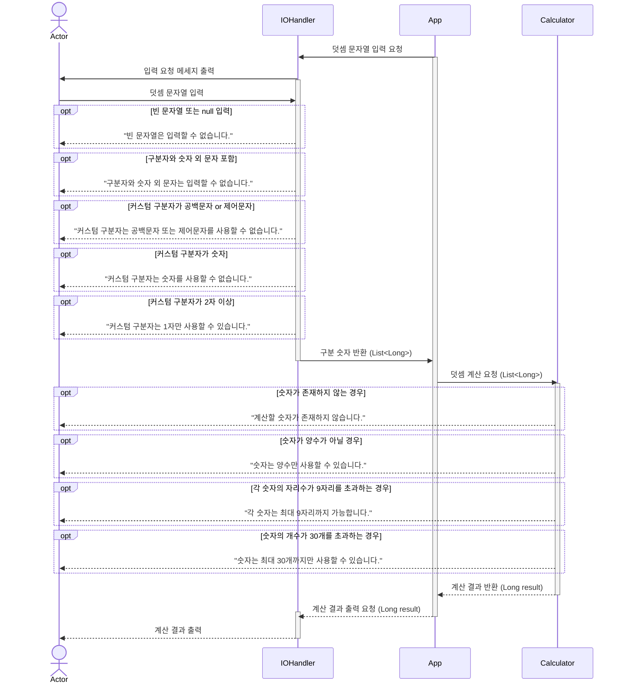
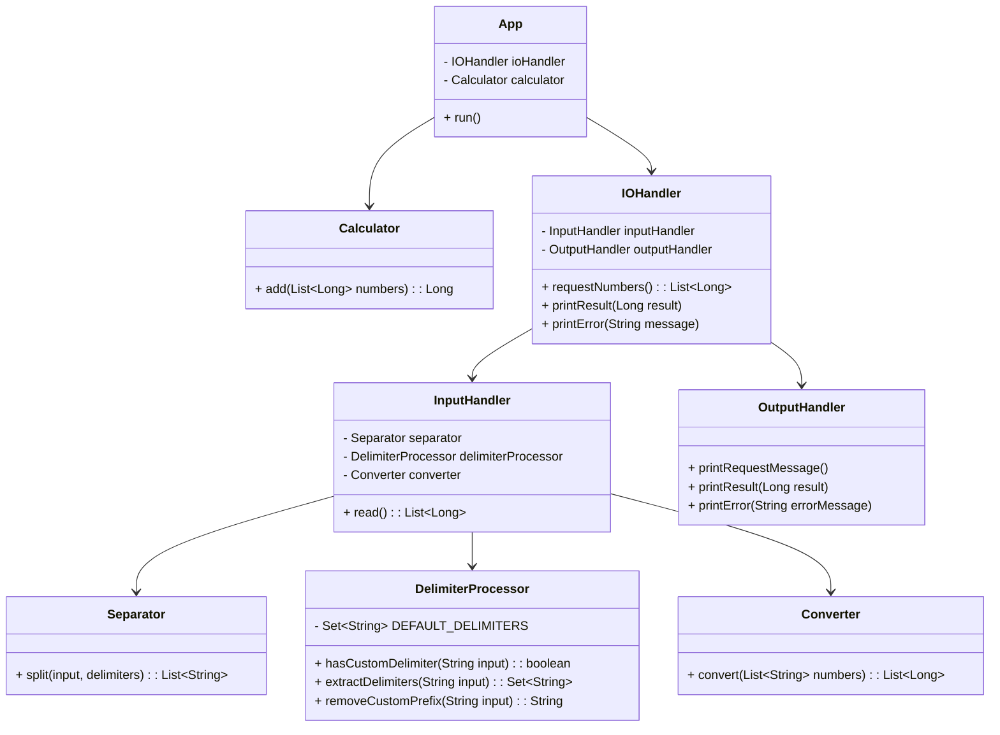

# 문자열 덧셈 계산기

## 요구사항

> 각 숫자들을 더한 값을 계산한다.

### < Happy Cases >

- 각 숫자들의 합을 계산한다.

### < Constraints >

- 각 숫자는 최대 9자리 양수이다.
- 숫자는 최대 30개까지 더할 수 있다.

### < Fail Cases >

- 숫자가 양수가 아닐 경우, `IllegalArgumentException`을 발생시킨다.
- 각 숫자의 자리수가 9자리를 초과하는 경우, `IllegalArgumentException`을 발생시킨다.
- 숫자의 개수가 30개를 초과하는 경우, `IllegalArgumentException`을 발생시킨다.

> 문자열에서 구분자를 통해 숫자를 구분한다.

### < Happy Cases >

- 구분자를 통해 문자열 내 숫자들을 추출한다.
- 숫자가 하나만 있을 경우, 해당 숫자를 반환한다.

### < Constraints >

- 구분자가 연속으로 이어질 경우, 하나의 구분자로 간주한다.
    - 예: "1,,2" => `1, 2`, "1::2" => `1, 2`, "1,:2" => `1, 2`
- 각 숫자는 최대 9자리이다.

### < Fail Cases >

- 구분자와 숫자 외 문자가 포함된 경우, `IllegalArgumentException`을 발생시킨다.
- 숫자가 9자리를 초과하는 경우, `IllegalArgumentException`을 발생시킨다.
- 빈 문자열일 경우, `IllegalArgumentException`을 발생시킨다.

> 입력받은 문자열에서 커스텀 구분자 확인 유무를 확인한다.

### < Happy Cases >

- 커스텀 구분자가 존재하는지 확인한다.
- 문자열의 길이가 4 이하면, 커스텀 구분자가 존재하지 않는 것으로 간주한다.

### < Constraints >

- 커스텀 구분자는 문자열 앞부분의 `//`와 `\n` 사이에 위치한다.

> 입력받은 문자열에서 구분자를 반환한다.

### < Happy Cases >

- 커스텀 구분자가 존재하지 않으면, 기본 구분자만 반환한다.
- 커스텀 구분자가 존재하면, 커스텀 구분자를 포함한다.

### < Constraints >

- 기본 구분자는 쉼표(,), 콜론(:)이다.
- 커스텀 구분자는 문자열 앞부분의 `//`와 `\n` 사이에 위치하는 `단일` 문자이다.
    - ex) "//;\n1;2;3" => 커스텀 구분자: `;`
- 커스텀 구분자는 제어 문자, 공백, 숫자를 제외한 아스키코드 문자이다.

### < Fail Cases >

- 커스텀 구분자가 공백문자 또는 제어문자 경우, `IllegalArgumentException`을 발생시킨다.
- 커스텀 구분자가 숫자일 경우, `IllegalArgumentException`을 발생시킨다.
- 커스텀 구분자가 2자 이상일 경우, `IllegalArgumentException`을 발생시킨다.

> 커스텀 구분자를 나타내는 문자열을 제거한 문자열을 반환한다.

### < Happy Cases >

- 커스텀 구분자를 나타내는 문자열을 제거한다.

### < Constraints >

- 커스텀 구분자는 문자열 앞부분의 `//`와 `\n` 사이에 위치한다.
- 커스텀 구분자가 존재하지 않는 경우, 원본 문자열을 반환한다.

### < Fail Cases >

> 사용자의 입력을 받아, 숫자 리스트를 반환한다.

### < Happy Cases >

- 사용자의 입력을 받아 숫자 리스트를 반환한다.

### < Constraints >

- `camp.nextstep.edu.missionutils`의 `Console` API를 사용한다.

### < Fail Cases >

- 입력값이 null이거나 빈 문자열일 경우, `IllegalArgumentException`을 발생시킨다.

> 계산 결과를 출력한다.

### < Happy Cases >

- 계산 결과를 출력한다.

### < Constraints >

- 예외가 발생했을 경우, 예외 메시지를 출력시킨다.

---

## 시퀀스 다이어그램

---

## 클래스 다이어그램

